<script src="https://ajax.googleapis.com/ajax/libs/jquery/3.6.0/jquery.min.js"></script>

<script type="text/x-mathjax-config">
MathJax.Hub.Register.StartupHook("TeX Jax Ready",function () {
  MathJax.Hub.Insert(MathJax.InputJax.TeX.Definitions.macros,{
    cancel: ["Extension","cancel"],
    bcancel: ["Extension","cancel"],
    xcancel: ["Extension","cancel"],
    cancelto: ["Extension","cancel"]
  });
});
</script>

<style>
section {
    display: flex;
    display: -webkit-flex;
}

section p {
    margin: auto;
}

section {
    height: 600px;
    width: 60%;
    margin: auto;
    border-radius: 20px;
    background-color: #212121;
}

section p {
    text-align: center;
    font-size: 30px;
    background-color: #212121;
    border-radius: 20px;
    font-family: Roboto Condensed;
    font-style: bold;
    padding: 15px;
    color: #bff4ee;
}

#center {

text-align: center;

}

.center p {
  margin: 0;
  position: absolute;
  top: 50%;
  left: 50%;
  -ms-transform: translate(-50%, -50%);
  transform: translate(-50%, -50%);

</style>

```{r setup, include=FALSE, purl=FALSE}
knitr::opts_chunk$set(echo = FALSE)

library(tidyverse)
library(ggplot2movies)
library(mosaic)
library(flipbookr)
library(patchwork)
library(knitr)
library(kableExtra)
library(fontawesome)
library(here)
library(DT)
library(scales)
library(latex2exp)
library(tweetrmd)
library(showtext)
font_add_google("Roboto Condensed", "roboto")
showtext_auto()
```

```{r echo = FALSE, purl=FALSE}
xaringanthemer::style_duo(
  primary_color = "#212121",
  secondary_color = "#f4eebf",
  table_row_border_color = "#212121",
  table_row_even_background_color = "#212121",
  footnote_font_size = "0.6em",
  header_font_google = xaringanthemer::google_font("Roboto Condensed", "700"),
  text_font_google   = xaringanthemer::google_font("Roboto Condensed", "400")
)

xaringanExtra::use_xaringan_extra(c("tile_view", "animate_css", "tachyons"))

xaringanExtra::use_logo(
  image_url = here::here("static", "img", "course_hex.png"),
  link_url = "https://edp613.asocialdatascientist.com",
  position = xaringanExtra::css_position(top = "1em", right = "1em")
  )
```

# Packages needed and a Note about Icons

Please load up the following packages. Remember to first install the ones you don't have.
```{r echo = TRUE, eval = FALSE, message=FALSE}
library(tidyverse)
library(mosaic)
library(ggplot2movies)
``` 

You may come across the following icons. The table below lists what each means.
```{r eval = TRUE, echo = FALSE, purl=FALSE}
forward <- as.character(fontawesome::fa("forward", fill = "
#4682b4"))

stop <- as.character(fontawesome::fa("stop", fill = "#ff6347"))

link <- as.character(fontawesome::fa("link", fill = "#5cb85c"))

bookmark <- as.character(fontawesome::fa("bookmark", fill = "#5cb85c"))


icon_desc <- tibble(
  
  Icon = c(forward,
           stop, 
           link,
           bookmark),
  
  Description = c("Indicates that an example continues on the following slide.",
                  "Indicates that a section using common syntax has ended.",
                  "Indicates that there is an active hyperlink on the slide.",
                  "Indicates that a section covering a concept has ended.")
  
)
```

```{r message=FALSE, warning=FALSE, eval = TRUE, echo = FALSE, purl=FALSE}
kable(icon_desc, 
      escape = FALSE,
      align = 'cl') %>%
  kable_styling(full_width = FALSE) %>%
  column_spec(1, width = "10em") %>%
  column_spec(2, width = "40em") %>%
  row_spec(0, background = "#181818") %>%
  row_spec(1, background = "#181818") %>%
  row_spec(2, background = "#181818") %>%
  row_spec(3, background = "#181818") %>%
  row_spec(4, background = "#181818") 
```

---

# What is a confidence interval?

A *confidence interval* (CI) gives a range of possible values for a parameter.  It depends on a specified _confidence level_ with 

--

- higher confidence levels corresponding to wider confidence intervals

--

- lower confidence levels corresponding to narrower confidence intervals.  

--

The most common confidence levels include 90%, 95%, and 99%.

---

# Problems with how confidence intervals are taught

You were just taught about the confidence interval in an bad way! 

--

- Finding confidence intervals for some mean is to first assume a normal curve for a population and then magic

--

- But assuming normality is a BIG assumption!

---

# Bootstrapping

--

Hypothesis testing

>- We simply want to if our $H_0$ or $H_1$ is correct.

--

>- First step in being able to generalize

--

<br>
Typically we have a sample of a population’s data so we can

1. take repeated samples from a sample data of size whatever

--

2. calculate the mean for each of these samples

--

3. created a new distribution of these means

--

4. estimate the population distribution 

<center>
aka <i>bootstrapping</i>
</center>

--

<ol start=5>
<li>calculate the confidence interval (CI)  
</ol>

---

# ggplot2movies

We'll look at CIs, but first let's look at the `ggplot2movies` data set...

```{r echo = TRUE, eval = TRUE}
head(movies)
```

---

...its size...

```{r echo = TRUE, eval = TRUE}
dim(movies)
```

That's 58,788 rows by 24 columns!

---

... and the names of its columns.

```{r echo = TRUE, eval = TRUE}
names(movies)
```

You can see more about the functionality by looking at its [documentation](https://cran.r-project.org/web/packages/ggplot2movies/ggplot2movies.pdf). For now, here's what the variables mean:

- **title**. Title of the movie.
- **year**. Year of release.
- **budget**. Total budget (if known) in US dollars
- **length**. Length in minutes.
- **rating**. Average IMDB user rating.
- **votes**. Number of IMDB users who rated this movie.
- **r1-10**. Multiplying by ten gives percentile (to nearest 10%) of users who rated this movie a 1.
- **mpaa**. [MPAA rating](https://www.motionpictures.org/film-ratings/).
- **Action**, **Animation**, **Comedy**, **Drama**, **Documentary**, **Romance**, **Short**. Binary variables representing if movie was classified as belonging to that genre.

.right[`r fa("link", fill = "#5cb85c")`]

---

# Descriptives 

Let's take a look at a bar chart of the genres. But wait, those are in a bunch of columns and R likes its data in long form! To get the data set to this form, let's first select the columns we need and then use a command called `pivot_longer` which emulates a pivot table in Excel. 

```{r sw1, include = FALSE}
movies %>%
  select(Action, Animation, Comedy,
         Drama, Documentary, Romance, Short) %>%
  pivot_longer(
    everything(),
    names_to = "genre"
  )
```

`r chunk_reveal(chunk_name = "sw1", color = c("white", "white", "white"))`

.right[`r fa("forward", fill = "#4682b4")`]

---

```{r sw2, include = FALSE}
select_movies <- movies %>%
  select(Action, Animation, Comedy, Drama, Documentary, Romance, Short) %>%
  pivot_longer(
    everything(),
    names_to = "genre"
  )

select_movies
```

`r chunk_reveal(chunk_name = "sw2", color = c("white", "white", "white"))`

---

# Pivot Wider

In instances where we have to go from a long to wide data set, we'd use a command called `pivot_wider`.

---

# What Just Happened?

The previous iteration of `pivot_wider` and `pivot_longer` were given by the commands `gather` and `spread`. To see what these did, let's start out with a cartoon by the very talented [Allison Horst](https://github.com/allisonhorst/stats-illustrations) out of UC Santa Barbara. 

```{r, echo = FALSE, out.height="25%", fig.height=1, out.width="25%", fig.align='center', purl=FALSE}
knitr::include_graphics("img/tidyr_spread_gather.png")
```

So the commands basically took data frames from wide to long with `gather` and back again with `spread`. The `pivot_` commands do much the same but with much more flexibility. However they can be equally as confusing so we'll go over a few basics here. If you're interested in more, take a look at this fantastic overview courtesy of [R-Ladies Sydney](https://rladiessydney.org/courses/ryouwithme/02-cleanitup-4/). For an advanced walkthrough, the [Data Wrangling](https://dcl-wrangle.stanford.edu/pivot_basic.html) site over at Stanford is a great resource. 
.right[`r fa("link", fill = "#5cb85c")`]

---

# pivot_longer

It is pretty rare that at this stage in your academic development that you need to go from long to wide so we'll be concentrating on the converse with `pivot_longer`. First note that the original graphics in this part of the walkthrough were not created by me, but by RStudio's [Allison Hill](https://alison.rbind.io/). I did however amend them for aesthetic purposes.

Ok let's begin!

.right[`r fa("link", fill = "#5cb85c")`] 
.right[`r fa("forward", fill = "#4682b4")`]

---

# An overview of pivot_longer 

We'll concentrate one two options in `pivot_longer`: `names_to` and `values_to`. 

```{r, echo = FALSE, out.height="50%", fig.height=1, out.width="50%", fig.align='center', purl=FALSE}
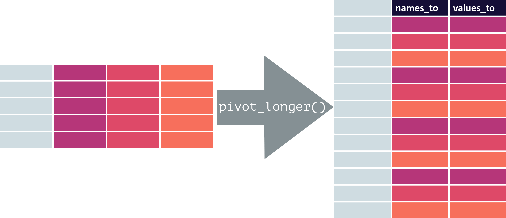
```

Remember you can always run `?` in front of any command in the Console to get more information about it. For `pivot_longer`, we would simply type in

```{r echo = TRUE, eval = FALSE}
?pivot_longer
```

to see other options. 
.right[`r fa("forward", fill = "#4682b4")`]

---

If you want to follow along with the fake data set we'll be using, run the following command to build the tibble

```{r echo = TRUE, eval = TRUE}
juniors_multiple <- tribble(
  ~ "baker", ~"cinnamon_1", ~"cardamom_2", ~"nutmeg_3",
  "Emma", 1L,   0L, 1L,
  "Harry", 1L,   1L, 1L, 
  "Ruby", 1L,   0L, 1L, 
  "Zainab", 0L, NA, 0L
)
```

and check it just to make sure

```{r echo = TRUE, eval = TRUE}
juniors_multiple
```

Looks good! Let's convert this!
.right[`r fa("forward", fill = "#4682b4")`]

---

To remind you of what the `juniors_multiple` data frame looks like, we have

```{r echo = FALSE, eval = TRUE, purl=FALSE}
juniors_multiple %>% 
  knitr::kable() %>%
  row_spec(0, extra_css = "border-bottom: solid;
           border-bottom-width:1px;
           border-bottom-color: #666666;")
```

We can assign names to the eventual columns using `names_to` and `values_to`.

```{r, echo = FALSE, out.height="55%", fig.height=1, out.width="55%", fig.align='center', purl=FALSE}
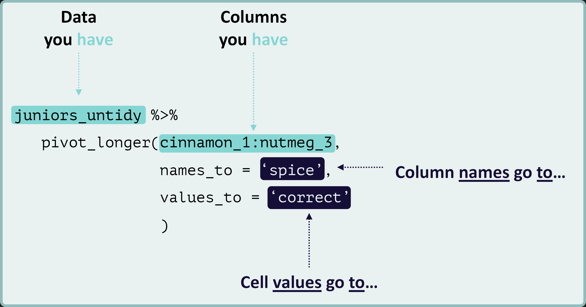
```
.right[`r fa("forward", fill = "#4682b4")`]

---

```{r echo = FALSE, eval = TRUE, purl=FALSE}
juniors_multiple %>% 
  knitr::kable() %>%
  row_spec(0, extra_css = "border-bottom: solid;
           border-bottom-width:1px;
           border-bottom-color: #666666;") 
```

We can assign names to the eventual columns using `names_to` and `values_to`.

```{r, echo = FALSE, out.height="55%", fig.height=1, out.width="55%", fig.align='center', purl=FALSE}
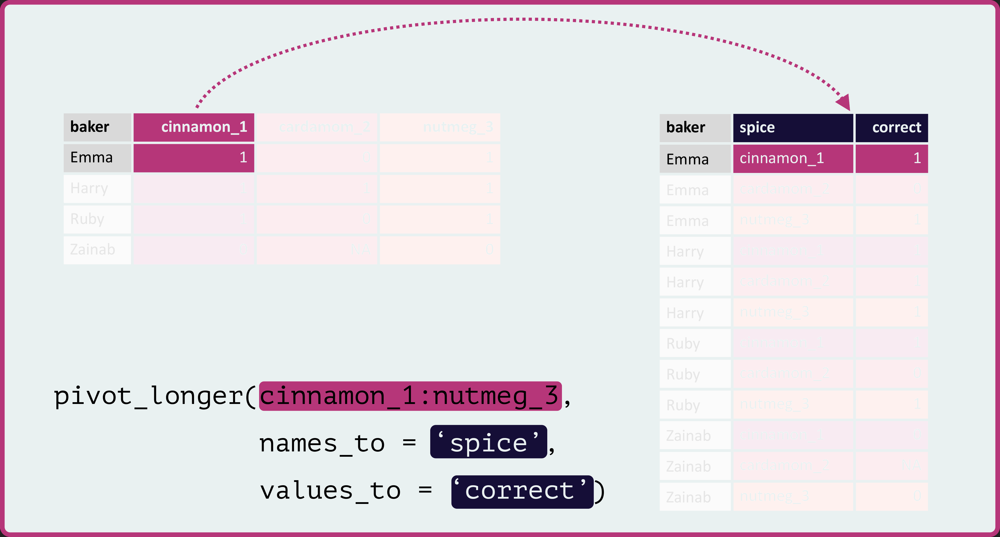
```
.right[`r fa("forward", fill = "#4682b4")`]

---

```{r echo = FALSE, eval = TRUE}
juniors_multiple %>% 
  knitr::kable() %>%
  row_spec(0, extra_css = "border-bottom: solid;
           border-bottom-width:1px;
           border-bottom-color: #666666;")
```

Here you can see the first column `cinnamon_1` and its value `1` associated with the first row `Emma` becomes our first two values under the two columns `spice` and `correct` for our pivoted data frame.

```{r, echo = FALSE, out.height="55%", fig.height=1, out.width="55%", fig.align='center', purl=FALSE}
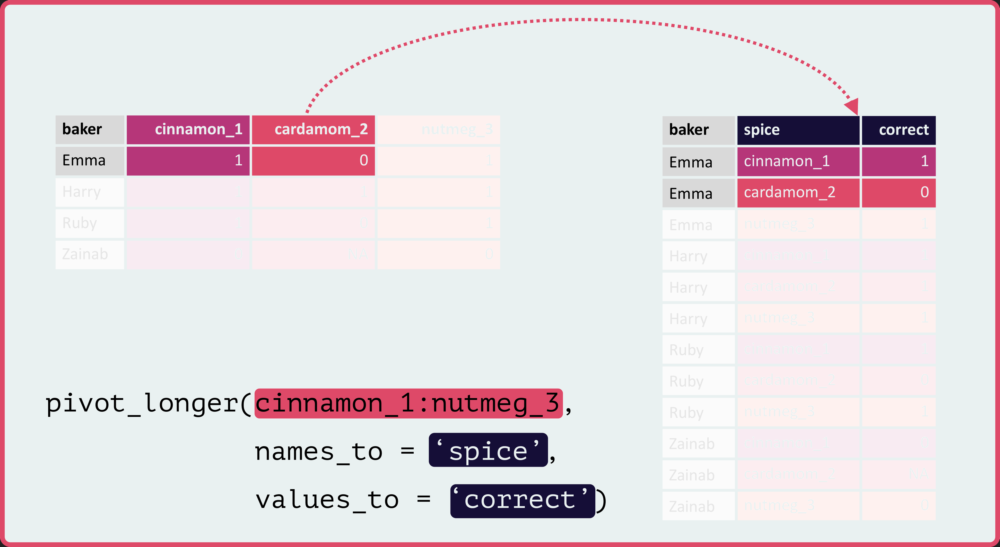
```
.right[`r fa("forward", fill = "#4682b4")`]

---

This pattern continues until a whole row is used up.

```{r, echo = FALSE, out.height="55%", fig.height=1, out.width="55%", fig.align='center', purl=FALSE}
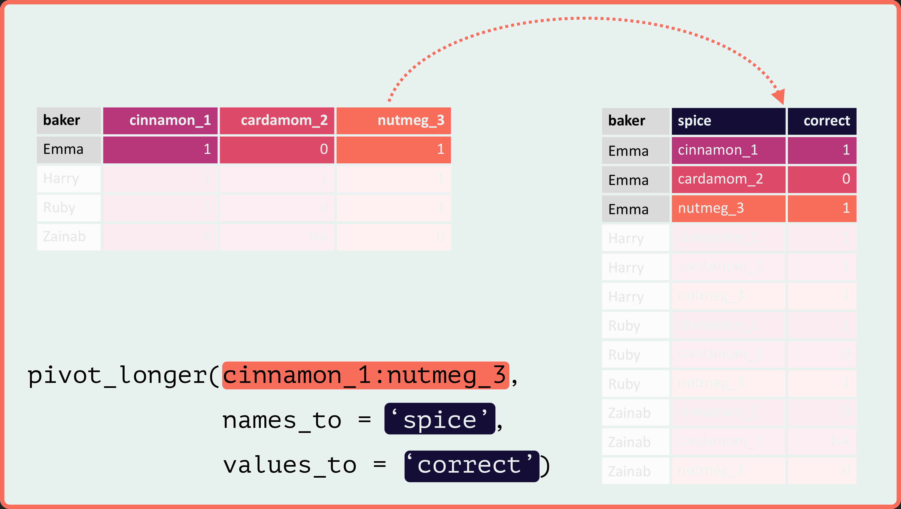
```

.right[`r fa("forward", fill = "#4682b4")`]

---

Then it repeats for the next row of values...

```{r, echo = FALSE, out.height="30%", fig.height=1, out.width="30%", fig.align='center', purl=FALSE}
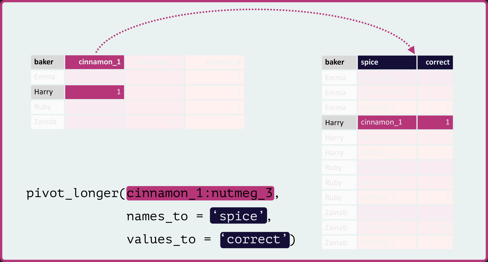
```

```{r, echo = FALSE, out.height="30%", fig.height=1, out.width="30%", fig.align='center', purl=FALSE}
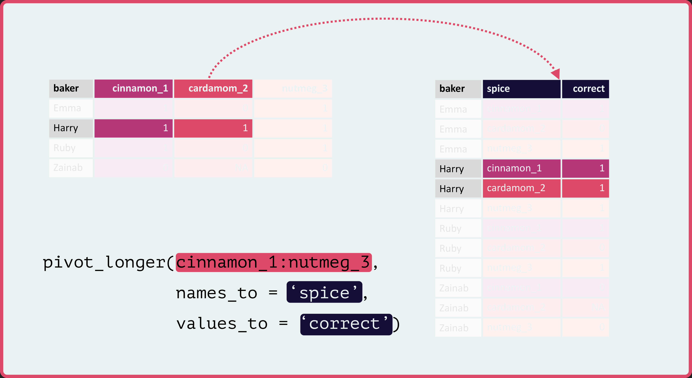
```

```{r, echo = FALSE, out.height="30%", fig.height=1, out.width="30%", fig.align='center', purl=FALSE}
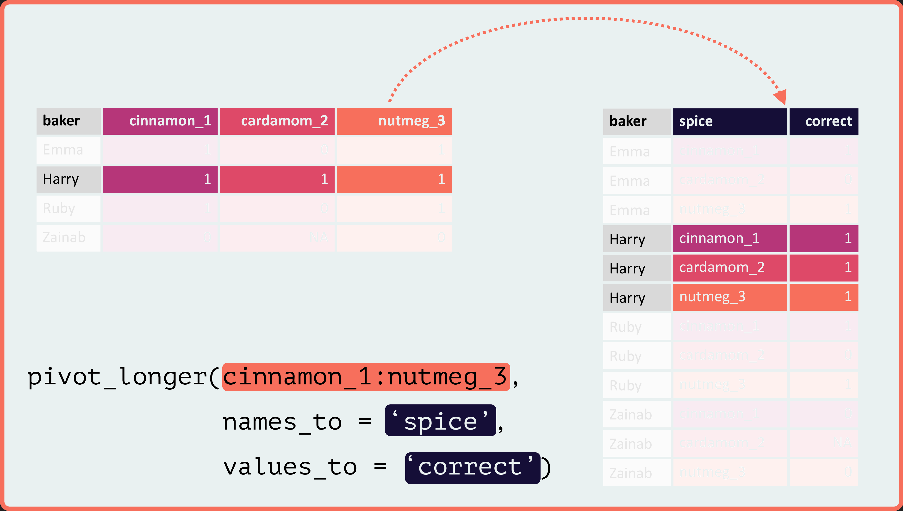
```
.right[`r fa("forward", fill = "#4682b4")`]

---

...and so forth...

```{r, echo = FALSE, out.height="30%", fig.height=1, out.width="30%", fig.align='center', purl=FALSE}
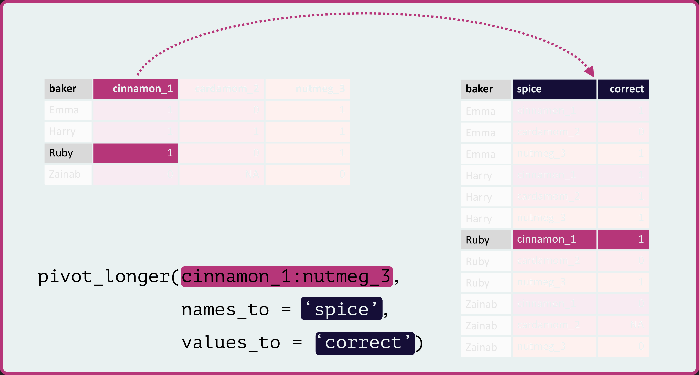
```

```{r, echo = FALSE, out.height="30%", fig.height=1, out.width="30%", fig.align='center', purl=FALSE}
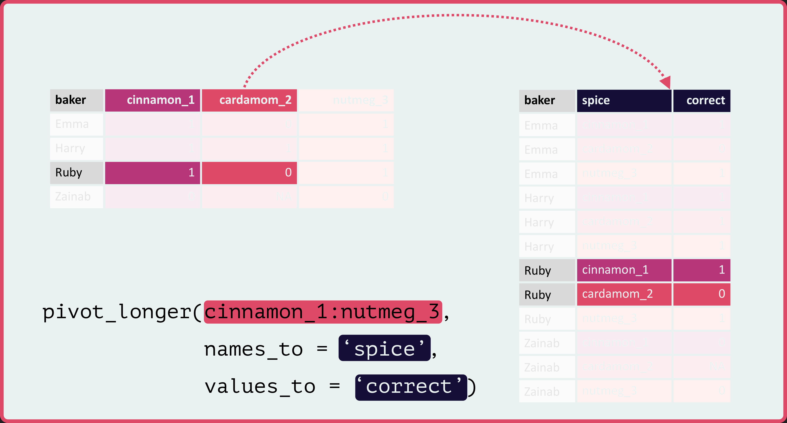
```

```{r, echo = FALSE, out.height="30%", fig.height=1, out.width="30%", fig.align='center', purl=FALSE}
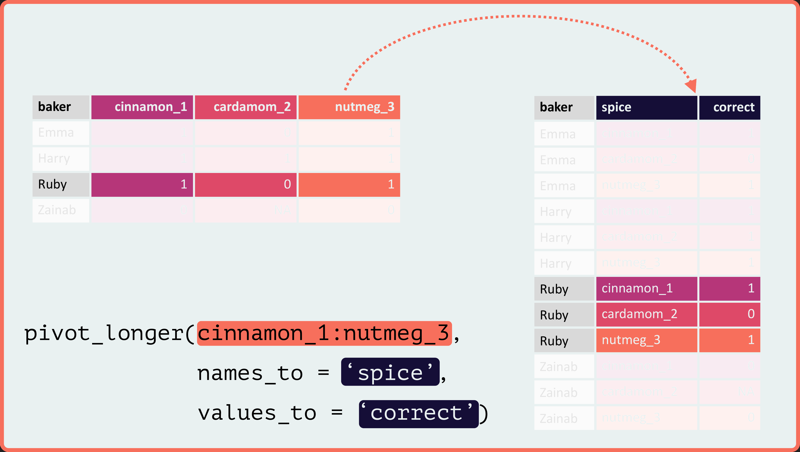
```
.right[`r fa("forward", fill = "#4682b4")`]

---

...until we run out of rows...

```{r, echo = FALSE, out.height="30%", fig.height=1, out.width="30%", fig.align='center', purl=FALSE}
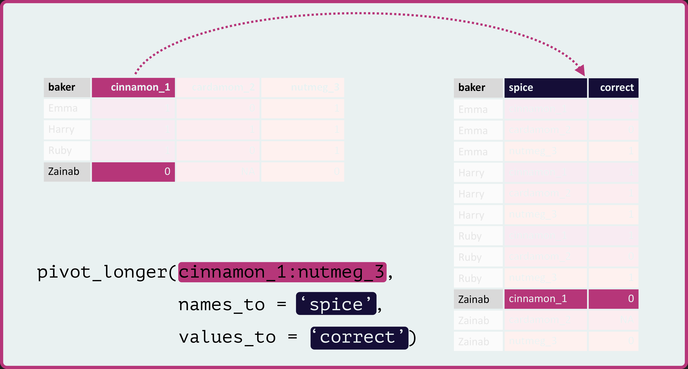
```

```{r, echo = FALSE, out.height="30%", fig.height=1, out.width="30%", fig.align='center', purl=FALSE}
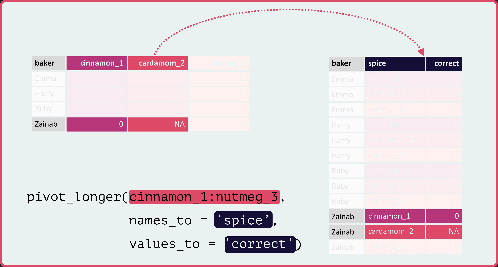
```

```{r, echo = FALSE, out.height="30%", fig.height=1, out.width="30%", fig.align='center', purl=FALSE}
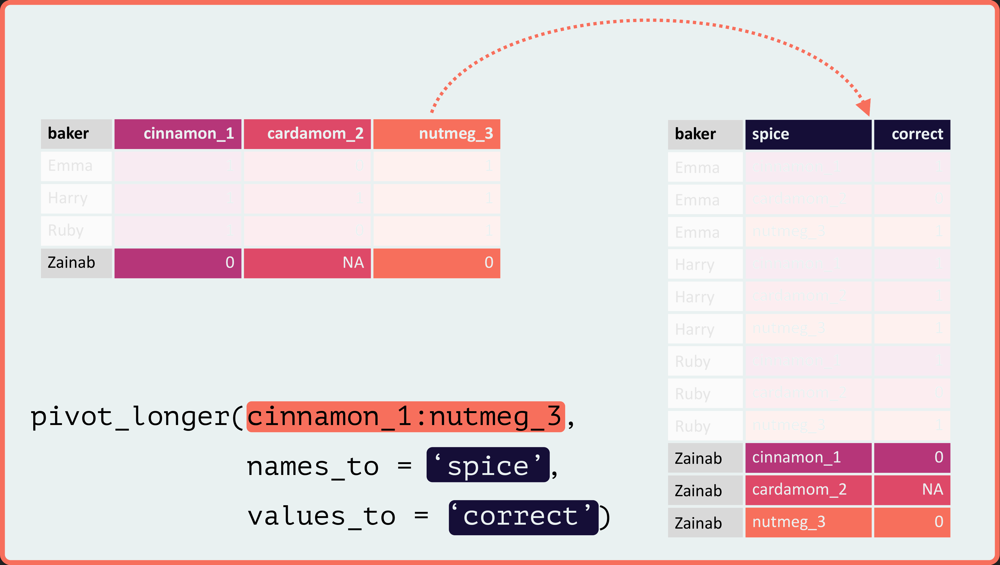
```
.right[`r fa("forward", fill = "#4682b4")`]

---

...and get the final table of pivoted values.

```{r, echo = FALSE, out.height="75%", fig.height=1, out.width="75%", fig.align='center', purl=FALSE}
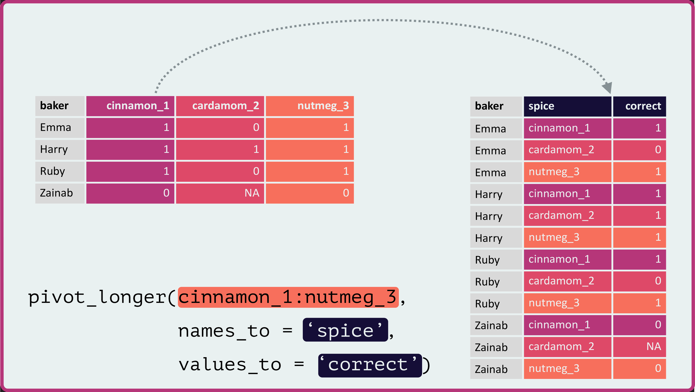
```

.right[`r fa("forward", fill = "#4682b4")`]

---

We can even amend the current command to include things like `order`!

```{r, echo = FALSE, out.height="75%", fig.height=1, out.width="75%", fig.align='center', purl=FALSE}
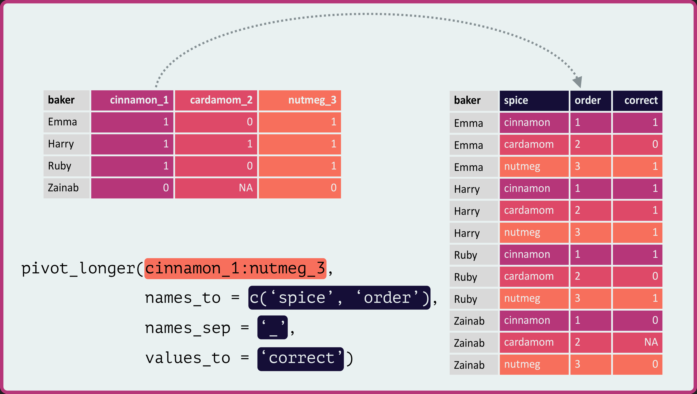
```

.right[`r fa("stop", fill = "#ff6347")`]

---

# Shortcut

Rather than accounting for every column, you can just tell R not to account for columns
```{r sw3, include = FALSE}
juniors_multiple %>%
  pivot_longer(-baker,
                names_to = c('spice', 'order'),
                names_sep = '_',
                values_to = 'correct')
```

`r chunk_reveal(chunk_name = "sw3", color = c("white", "white", "white"))`

---

# Single column types

`pivot_wider` is great for columns of the same type. For example, if we run 

```{r echo = TRUE, eval = TRUE}
glimpse(juniors_multiple)
```

all we have are integers... 

---

# Multiple column types

... but for the following

```{r echo = TRUE, eval = TRUE}
juniors_multiple_full <- tribble(
  ~ "baker", ~"score_1", ~"score_2", ~"score_3", 
  ~ "guess_1", ~"guess_2", ~"guess_3",
    "Emma", 1L,   0L, 1L, "cinnamon", "cloves", "nutmeg",
    "Harry", 1L,   1L, 1L, "cinnamon", "cardamom", "nutmeg",
    "Ruby", 1L,   0L, 1L, "cinnamon", "cumin", "nutmeg",
    "Zainab", 0L, NA, 0L, "cardamom", NA_character_, "cinnamon"
  )
```

```{r echo = TRUE, eval = TRUE}
juniors_multiple_full
```

.right[`r fa("forward", fill = "#4682b4")`]
---

```{r echo = TRUE, eval = TRUE}
glimpse(juniors_multiple_full)
```

...we have both character and numeric vectors.

---

Try running the following

```{r echo = TRUE, eval = FALSE}
juniors_multiple_full %>% 
  pivot_longer(score_1:guess_3,
               names_to = c('score', 'guess'),
               names_sep = "_",
               values_to = 'correct')
```

Do you get `Error: Can't combine score_1 <integer> and guess_1 <character>.`? So what can you do?

Well since computers are stupid, you have to tell R what to look for.

---

# Generalizing

We can actually just tell R to treat all values the same.
```{r echo = TRUE, eval = TRUE}
juniors_multiple_full %>% 
  # Don't do anything with the baker column
    pivot_longer(-baker, 
                 # Treat all columns the same and order them
                 names_to = c(".value", "order"), 
                 # Control how the column names are broken up
                 names_sep = "_")
```

---

## Thats it!

